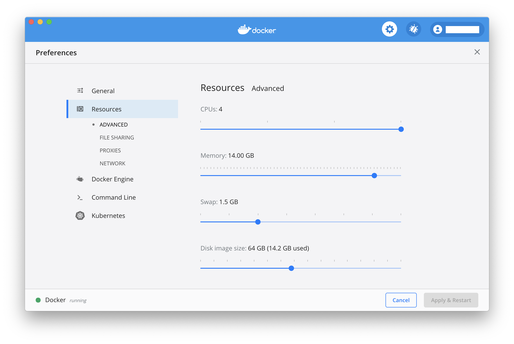
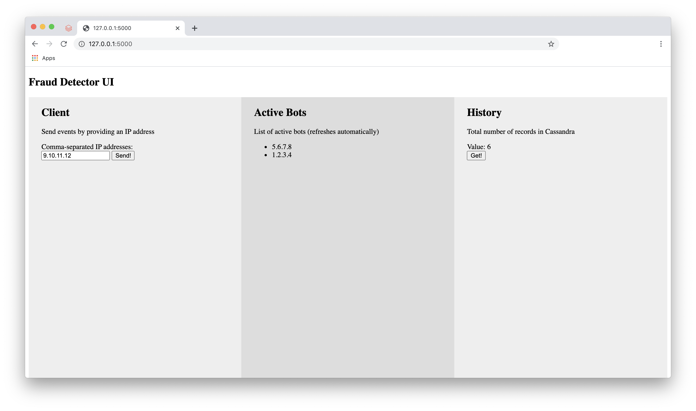

# In-Stream Processing: Capstone Project

Implement a solution that allows identifying IP addresses belonging to bots
in accordance with the following algorithm:

* More than 20 requests per 10 seconds for single IP.
* IP should be whitelisted in 10 minutes if bot detection condition is not matched.
  It means IP should be deleted from cache once host stops suspicious activity.

## Stack
* Apache Kafka as a messaging backbone
* Spark Streaming for processing
* Apache Ignite / Redis as a lookup service to maintain all active bots
* Cassandra / AWS S3 as storage for all incoming events, including bot events as well

## Design
```

+-----------------------+        +-----------------------+
|                       |        |                       |
|                       v        v                       |
|                  +----+--------+---+                   |
|                  |       UI        |                   |
|                  |     (Flask)     |                   |
|                  +--------+--------+                   |
|                           |                            |
|                           v                            |
|                  +--------+--------+                   |
|                  |   Message Bus   |                   |
|                  |     (Kafka)     |                   |
|                  +--------+--------+                   |
|                           |                            |
|                           v                            |
|             +-------------+------------+               |
|             |   Fraud Detector Service |               |
|             |         (Spark)          |               |
|             +------+------------+------+               |
|                   /              \                     |
|                  /                \                    |
|                 v                  v                   |
|      +---------+---------+ +--------+----------+       |
|      |  Lookup Service   | | Long Term Storage |       |
|      |      (Redis)      | |    (Cassandra)    |       |
|      +---------+---------+ +---------+---------+       |
|                |                     |                 |
|                |                     |                 |
+----------------+                     +-----------------+

```

## Running locally

### Prerequisites
1. Install jdk 8 (make sure `JAVA_HOME` is set properly)
1. Install sbt
1. Install docker and docker-compose
1. Allocate enough resources to docker (RAM: 14+ Gb, CPUs: 4+, Disk: 16+ Gb)
   

### Running
1. Build `fraud-detector-service` Spark app:
   ```
   cd ./fraud-detector-service
   sbt clean assembly
   cd ..
   ```
1. Run
   ```
   docker-compose up --build
   ```
1. Wait for `fraud-detector-service` Spark app to start
1. Open `fraud-detector-ui`: http://127.0.0.1:5000/
   
1. Send events from a list of IPs in the left panel.
   Suspicious IP addresses will be refreshed periodically from Redis and displayed in the middle.
   Accumulated history can be retrieved from Cassandra using the right panel.
   Bot detection algorithm parameters can be customized [here](./fraud-detector-service/submit.sh#L26-L29).
   To apply new parameters, stop and delete created resources in accordance with the next step.
1. Stop docker-compose with `Ctrl+C`, and run
   ```
   docker-compose down -v
   ```
